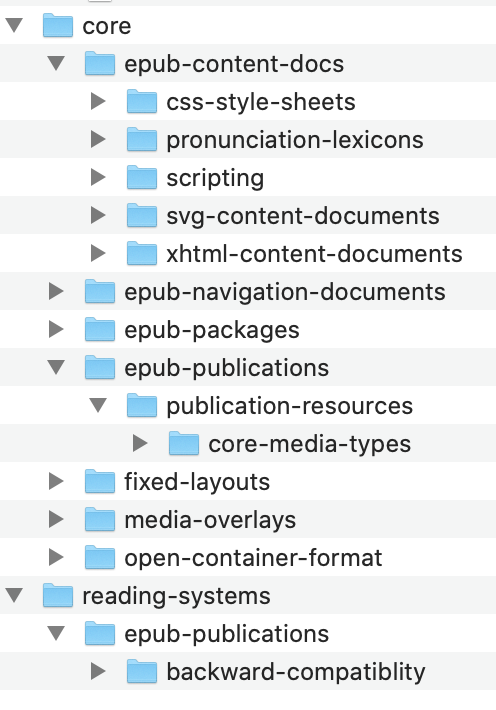

# Test repository for the EPUB 3 specifications

This is the repository for epub-tests. You're welcome to contribute!

## What to test

We should test every normative statement in our specs (that is, every `MUST` or `SHOULD` or `MAY`).

We use the [spreadsheet of EPUB 3.3 Tests](https://docs.google.com/spreadsheets/d/13wgptApSVbQbYzi2L5VXe3D_1QLzJOTGySUAtOxn4sA/edit#gid=0) to track the normative statements and whether they are tested.

## How to test

### Organizing tests

We propose to organize tests as the specs are organized, with a folder structure matching the section structure of the specs:

Because sections are frequently renumbered, individual tests should be named based on section anchors within the spec. If multiple tests are necessary for a single anchor, differentiate the test cases by appending an underscore and a unique identifier. For example, a test for JPEG support as part of the requirement to support [Core Media Types Resources](https://www.w3.org/TR/epub-rs-33/#confreq-rs-epub3-images) might be named `confreq-rs-epub3-images_jpeg`.